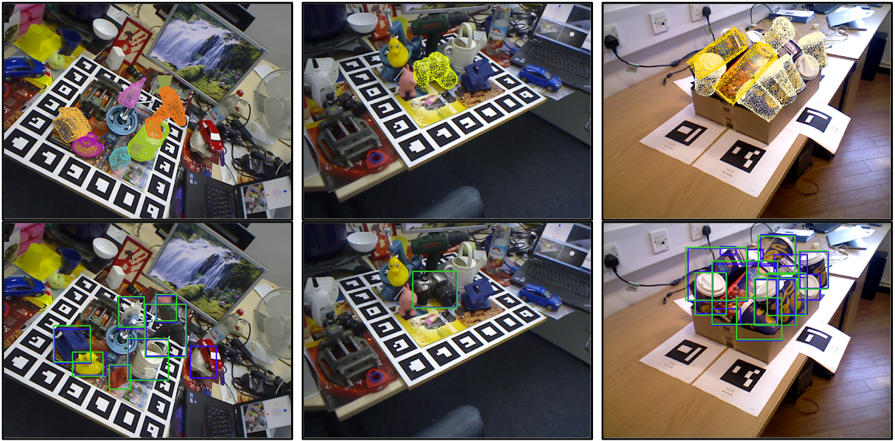

<h1 align="center">
COPE: End-to-end trainable Constant Runtime Object Pose Estimation
</h1>

<div align="center">
<h3>
<a href="https://github.com/sThalham">Stefan Thalhammer</a>,
<a href="https://github.com/tpatten">Timothy Patten</a>,
<a href="http://github.com/v4r-tuwien">Markus Vincze</a>,
<br>
<br>
Accepted for publication at WACV: Winter Conference on Applications in Computer Vision, 2023, algorithms track
<br>
<br>
<a href="https://arxiv.org/pdf/2208.08807.pdf">[Paper]</a>
<br>
<br>
</h3>
</div>



# Citation
Please cite the paper if you are using the code:

```
@inproceedings{thalhammer2023cope,
title= {COPE: End-to-end trainable constant runtime object pose estimation}
author={S. {Thalhammer} and T. {Patten} and M. {Vincze}},
journal={arXiv preprint arXiv:2208.08807},
year={2022}}
```

# Installation

```
git clone https://github.com/sThalham/COPE.git
python3 -m pip install opencv-python==4.4.0.40
python3 -m pip install pillow
python3 -m pip install matplotlib
python3 -m pip install transforms3d
python3 -m pip install glumpy
python3 -m pip install open3d-python
python3 -m pip install PyOpenGL
python3 -m pip install imgaug
```

Alternatively, use the provided Dockerfile to deploy a Docker container that satisfies the version requirements.

Notes:
- Results in the paper are generated using NVIDIA CUDA 11.6

